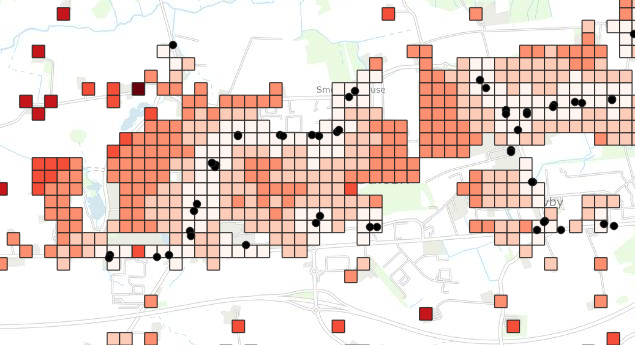
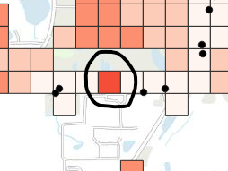

# Formål

Beregn distancen på OSM vej- og stinettet fra geometriske objekter (f.eks. befolkningskvadratnet, arbejdspladser, uddannelsesinstitutioner) til nærmeste stoppested. 
Området er som udgangspunkt Region Midtjylland, men ethvert administrativt område fra OpenStreetMap kan anvendes. 

 
 

# Data

* Geometrisk inputfil som shapefil
    - Skal indeholde en geometrikolonne med navnet geometry
    - Kan f.eks. være Befolkningskvadratnet, Arbejdspladser, Udannelsesinstitutioner mv.
* Standerfil som CSV med UTM32N koordinater.
    - Skal indeholde kolonnerne: UTM32_Easting, UTM32_Northing, Long name, Kode til stoppunkt og Pos.nr.
* Dobbeltrettet OSM netværk af typen ”all” hentes automatisk. Inkluderer alle typer veje og stier indenfor det administrative område.

 
 

# Procedure

## Opsætning af Data
* Placer geometrisk inputfil (.shp) i mappen Data
* Placer stoppestedsfil (.csv) i mappen Data
* Åben *data_handler.py* i VSCode
* Er geometrikolonnen i input understøttet af *select_method* dvs. af typen Polygon eller Point?
    - Hvis ja, spring ned til Kørsel af Algoritme
    - Ellers skrives en funktion som 1. læser dataen og 2. transformerer kolonnen *geometry* til *geometry_center* med datatypen *Point* og 3. tilføj else if case til *select_method*

 

## Kørsel af Algoritme
* Åben *algoritme_script.py* i VSCode og kør. Intet skal ændres i denne fil!
* Indtast inputs. Default værdi er angivet som [...].
    - Konfigurationsmetoden til geometrien for input er obligatorisk. Nuværende er kun *Kvadratnet* eller *Punkter* understøttet
    - Konfigurationsmetoden til geometrien for stop er obligatorisk. Kun *MobilePlan* er understøttet
    - Filnavnet for standerfilen er påkrævet f.eks. *MT_Stoppunkter_20241015.csv*
    - Filnavnet for inputfil er påkrævet f.eks. *befolkning_2024.shp*
    - OSM område er som udgangspunkt Region Midtjylland men kan ændres til andre administrative områder f.eks. Aarhus Kommune
    - Flextur, Plustur og nedlagte standere fjernes som udgangspunkt
    - 09 Standere beholdes som udgangspunkt
    - Stander chunk size kan sænkes fra 500 hvis memory er et problem
    - Minimum Forbundende Komponenter default 200, alle uforbundende grafer med færre knuder fjernes automatisk. Bør kunne forøges til 1000 hvis mange inputs ikke kan tildeles et nærmeste stop, men forøges den for meget vil f.eks. Venø blive frasorteret.
* Kør script (Kvadratnet tager cirka 90 minutter)
    - Cirka 10 minutter for indlæsning af data
    - Cirka 25 minutter for Dijkstra's Algoritme
    - Cirka 15 miutter for at hente geometrien for korteste vej for hvert input
    - Cirka 40 minutter for at skrive shapefiler
* Outputs ligger i mappen Resultater
* Upload resultater til Webgis
* Evt. slet cache og pycache

 

## Resultat
1. Første output indeholder:
    * Alle kolonner og geometrien fra input filen
    * Navn og nummer på nærmeste stander til hver geometriske punkt
    * (dist\_total) Den totale distance mellem centroiden af kvadratet og gps punkt for nærmeste stander (summen af de tre næste distancer)
    * (dist\_input) Distance fra input til nærmeste OSM knude
    * (dist\_stop) Distance fra standerens gps punkt til nærmeste OSM knude
    * (dist\_path) Distance mellem inputtets OSM knude og standerens OSM knude
2. Andet output indeholder:
    * Det samme, dog er geometrien en Linestring som viser vejen fra objektet til nærmeste stoppested.

 

**_Vigtigt:_** 
Alle beregningerne indeholder en usikkerhed da geometriske punkter og standere tildeles OSM knuder. 
Vej- og stinettet fra OpenStreetMap er en graf som består af et sæt knuder og kanter. 
Selvom Region Midtjylland har over 1 million knuder, findes der ikke én knude som er præcist placeret ved det geometriske punkt. 
I enkelte tilfælde betyder det at et kvadrat har en højere distance sammenlignet med nabokvadraterne, hvis den nærmeste OSM knude er langt væk. 

 
 

# Dokumentation af løsning

Python [OSMNX](https://osmnx.readthedocs.io/en/stable/) og [NetworkX](https://networkx.org/) til at håndtere OSM grafen. 
Python [igraph](https://github.com/igraph/python-igraph) (Python interface til C bibliotek) anvendes til højeffektive udregninger af grafteori bl.a. ved parallelisering på flere CPU-kerner. Beregninger i C er meget hurtigere end beregniner i Python, derfor anvendes igraph fremfor OSMNX.  
Koblingen mellem Python og igraph er lavet med inspiration i Notebook 14 fra [OSMNX Notebooks](https://github.com/gboeing/osmnx-examples) 

Kerne-algoritmen udregner korteste distance fra et punkt i inputfilen til nærmeste punkt i hjælpefilen. 

Programmets overordnet struktur:
1. Præprocessering
    * Indlæs geometrisk inputfil
    * Indlæs standere og anvend filtre
    * Fjern standere som befinder sig udenfor det administrative område
    * Hent OSM netværk med OSMNX
    * Fjern uforbundende komponenter fra OSM
    * Omdan OSM netværket til en igraph graf hvor kanter er vægtet med kantlængde i meter
    * Gem en mapping af igraph id til osmid og en mapping af osmid til igraph id
    * Find nærmeste OSM knude til alle geometriske punkter og gem distancen
    * Find nærmeste OSM knude til alle stop og gem distancen
    * Oversæt OSM knuder til igraph nodes
2. Processering
    * Find korteste distance fra hver stop knude til alle knuder på grafen
    * For hver geometrisk punkts knude, find det stop med kortest distance
3. Postprocessering
    * Find stien på vejnettet mellem input og nærmeste stop og gem som Linestring
    * Gem fil med det oprindelig input og angivelse af nærmeste stop
    * Gem fil med stien på vejnettet

 
 

## Effektivitet
Definer følgende:
* $V$ betegner sættet af knuder i grafen og antallet er $|V|$.
* $E$ betegner sættet af kanter i grafen og antallet er $|E|$.
* $S$ betegner sættet af sources (startpunkter) og antallet er $|S|$.
* $T$ betegner sættet af targets (slutpunkter) og antallet er $|T|$.
Bemærk at $S$ og $T$ begge er delmænder knuderne på grafen, altså $S \subset V$ og $T \subset V$.  

### Algoritme 1: optimal
Find korteste vej fra hvert startpunkt til hvert slutpunkt $S_i \rightarrow T_j$ for alle $i=1, ..., |S|$ og $j=1, ..., |T|$.
Denne løsning er sikret at give en optimalløsning, dog er det en naiv brute-force tilgang.  

Antal gentagelser af korteste vej algoritmen: $|S| |T|$  
Forventet tidskompleksitet med Dijkstras Algoritme: $O_1 = O(|S| |T| (|V| + |E|) \ln{(|V|)})$  

### Algoritme 2: heuristik
Find korteste vej fra hvert startpunkt $S_i$ til sættet af slutpunkter $K_i$ som er tættest på $S_i$ i fugleflugtsdistance, hvor sættet af slutpunkter altid har størrelsen $|K|$. $S_i \rightarrow T_j$ for $i=1, ..., |S|$ og $j \in K_i$.  
Præprocesseringen af fugleflugtdistancer koster $O(|S| |T|)$.  
Løsningen er en heuristik tilgang som ikke er garanteret at give en optimalløsning, f.eks. hvis et startpunkt er meget langt væk fra de nærmeste slutpunkter, kan det forventes at distancen i fugleflugt meget anderledes en distancen på vejnettet.  

Antal gentagelser af korteste vej algoritmen: $|S| |K|$  
Forventet tidskompleksitet med Dijkstras Algoritme: $O_2 = O(|S| |K| (|V| + |E|) \ln{(|V|)} + |S| |T|)$  

### Algoritme 3: optimal
Find korteste vej fra hvert startpunkt $S_i$ til alle knuder i grafen $S_i \rightarrow V_l$ for $i=1, ..., |S|$ og $l=1, ..., |V|$. Problemet er hermed løst da $T \subset V$ så for hvert startpunkt findes det slutpunkt med korteste ditance hvilket koster $O(|S| |T|)$  

Antal gentagelser af korteste vej algoritmen: $|S|$  
Forventet tidskomplexitet med Dijkstras Algortime: $O_3 = O(|S| (|V| + |E|) \ln{(|V|)} + |S| |T|)$  

### Algoritme 4: optimal
Hvis $|S| > |T|$ kan vi omskrive [Algoritme 3](#algoritme-3-optimal) til at løse korteste vej fra hvert slutpunkt $T_j$ til alle knuder i grafen $T_j \rightarrow V_l$ for $l=1, ..., |V|$ og $j=1, ..., |T|$. Efterprocesseringen koster stadig $O(|S| |T|)$.  

Antal gentagelser af korteste vej algoritmen: $|T|$  
Forventet tidskomplexitet med Dijkstras Algortime: $O_4 = O(|T| (|V| + |E|) \ln{(|V|)} + |S| |T|)$  

### Konkret eksempel
OSM i Midtjylland har $|V| \approx 1200000$ knuder og $|E| \approx 400000$ stier.  
Befolkningskvadratnettet i Midtjylland har $|S| \approx 110000$ kvadrater, Midttrafik har $|T| \approx 10000$ stoppesteder og lad sæt antal naboer til $|K|=20$.  

[Algoritme 2](#algoritme-2-heuristik) er $\frac{O_1}{O_2} = 500$ gange hurtigere end [Algoritme 1](#algoritme-1-optimal).  
[Algoritme 3](#algoritme-3-optimal) er $\frac{O_2}{O_3} = 20$ gange hurtigere end [Algoritme 2](#algoritme-2-heuristik).  
[Algoritme 4](#algoritme-4-optimal) er $\frac{O_3}{O_4} = 11$ gange hurtigere end [Algoritme 3](#algoritme-3-optimal).  
Det svarer til at [Algoritme 4](#algoritme-4-optimal) er 110000 gange hurtigere end brute-force metoden, [Algoritme 1](#algoritme-1-optimal).  

[Algoritme 4](#algoritme-4-optimal) tager på nuværende tidspunkt 20 minutter med igraph.  
[Algoritme 3](#algoritme-3-optimal) forventes at tage 3.5 timer.  
[Algoritme 2](#algoritme-2-heuristik) forventes at tage 3 dage.  
[Algoritme 1](#algoritme-1-optimal) forventes at tage 4 år!  

 
 

# Backlog

* Kun distancen til stoppesteder er understøttet på nuværende tidspunkt
* For nogle få objekter kan der ikke findes en vej til et stoppested. Skyldes muligvis at det nærmeste OSM id befinder sig i en uforbundet graf med flere end Minimum Forbundende Komponenter (default 200) antal knuder.
* Skrivning af shapefil fra geopandas er langsom for store datamængder
