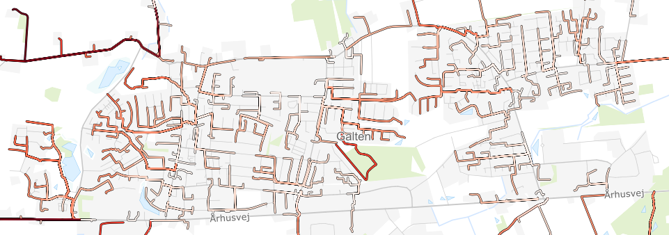

# Formål

Effektivt udregner gå-afstand mellem alle objekter i to inputfiler på OpenStreetMaps vej- og stilag.</br>
Udviklet med henblik på at regne afstande mellem stoppesteder og befolkningskvadratnet men kan anvendes med vilkårligt punktbaseret data.</br>

Eksempler på brug:
* Grunddata/befolkningsdata.
    * Korteste vej til nærmeste stop fra hvert 100m*100m beboet område.
    * Tælle antal unikke afgange indenfor 500m gå-afstand for hvert beboelseskvadrat.
* CVR/virksomheder.
    * Korteste vej til nærmeste stop fra hver virksomhed.
* Uddannelsesinstitutioner/Uddannelsesinstitutioner med elevtal.
    * Korteste vej til nærmeste stop fra hver uddannelsesinstitution.
* Flextur
    * Vis flextur på vejnettet i stedet for fugleflugtslinjer.

Nye opgaver vedrørende afstande på vejnettet kan (relativt) nemt implementeres da programmet er opbygget med kompositionelt design.

<br/>
<br/>


# Procedure
* Første gang køres setup.py. Efterfølgende springes dette trin over.
* Input data
    * Placer filen i mappen [src/Data](src/Data/)
    * Husk der skal være en id kolonne med navnet **id**
    * Bemærk Multipoint geometri understøttes ikke. MultiPoint kam laves til Point med multipart til singlepart.
* Hent stoppesteder og flextursknudepunkter
    * Åben QGIS og connect til PostgreSQL
    * Kør SQL koden [scripts/aktuelle_stop.sql](scripts/aktuelle_stop.sql)
    * Download Shapefil med koordinatsystem **EPSG:25832**
    * Placer filen i mappen [src/Data](src/Data/)
* Kør script
    * Kør [run.py](run.py) i VSCode
    * Indtast de korrekte input (se eksempler længere nede)
        * OBS: (...) er valgmuligheder
        * OBS: [...] er default værdier, her kan klikkes enter.
        * OBS: chunk size er default 500, hvis der er problemer med *out of memory*, kan den sænkes mod at programmet bliver lidt langsomere.
        * OBS: Mindste antal OSM knuder i uforbundende komponenter er default 200. Kan forøges hvis der er mange tilfælde hvor der ikke findes en vej. Et uforbundet komponent er en subgraf som ikke hænger sammen med hovedgrafen, f.eks. en ikke-brofast Ø eller en gangsti på taget af en bygning.
    * Vent på beregningerne er færdige. Tager 2-4 timer afhængigt af opgavetype og datamængde.
        * OBS: undgå andre CPU og memory krævende opgaver da det kan give out-of-memory fejl.
        * OBS: Hvis "RuntimeWarning: Couldn't reach some vertices." logges konsollen er det ikke et problem. Det skyldes at en OSM knude er del af en uforbundet komponent hvor der ikke findes en sti til den anden OSM knude.
    * Output ligger i [src/Resultater](src/Resultater/)
* Upload og tilret i Webgis (se eksempler længere nede)

<br/>


## Nærmeste stop
Vigtige parametre:
* OSM: Region Midtjylland
* Opgavetype: Nærmeste stop
* Fjern Flextur: True
* Fjern Plustur: True
* Fjern 09 stander: False
* Fjern nedlagte stop: True

<br/>

### Eksempler
1. Befolkningskvadratnet i Region Midtjylland.
* Navn på administrativt OSM område: Region Midtjylland
* CRS: EPSG:25832
* Sti til data: src\Data\
* Sti til resultater: src\Resultater\
* Indtast information om opgaven
    * Opgave type: Nærmeste stop
* Indtast information om input
    * Indlæsningstype: Polygoner
    * Navn på inputfil: befolkning_region_midt_2025.shp
* Indtast information om stop
    * Indlæsningstype: Shapefil
    * Navn på stopfil: MT_stop_og_flex_20250820.shp
    * Fjern Flextur: True
    * Fjern Plustur: True
    * Fjern 09 stander: False
    * Fjern nedlagte standere: True
    * Navn på kolonne som indeholder stopnummer: stopnummer
    * Navn på kolonne som indeholder stopnavn: stopnavn
    * Navn på kolonne som indeholder geometri: geometry
* Evt. ændre parametre
    * Skriv resultat: True
    * Chunk size: 500
    * Mindste antal knuder i et uforbundet komponent: 200
* Gå til Webgis 

<br/>

2. CVR i Region Midtjylland.
* Navn på administrativt OSM område: Region Midtjylland
* CRS: EPSG:25832
* Sti til data: src\Data\
* Sti til resultater: src\Resultater\
* Indtast information om opgaven
    * Opgave type: Nærmeste stop
* Indtast information om input
    * Indlæsningstype: Punkter
    * Navn på inputfil: cvr_midtjylland.shp
* Indtast information om stop
    * Indlæsningstype: Shapefil
    * Navn på stopfil: MT_stop_og_flex_20250820.shp
    * Fjern Flextur: True
    * Fjern Plustur: True
    * Fjern 09 stander: False
    * Fjern nedlagte standere: True
    * Navn på kolonne som indeholder stopnummer: stopnummer
    * Navn på kolonne som indeholder stopnavn: stopnavn
    * Navn på kolonne som indeholder geometri: geometry
* Evt. ændre parametre
    * Skriv resultat: True
    * Chunk size: 500
    * Mindste antal knuder i et uforbundet komponent: 200
* Gå til Webgis 

<br/>

3. Uddannelsesinstitutioner i Region Midtjylland.
* Navn på administrativt OSM område: Region Midtjylland
* CRS: EPSG:25832
* Sti til data: src\Data\
* Sti til resultater: src\Resultater\
* Indtast information om opgaven
    * Opgave type: Nærmeste stop
* Indtast information om input
    * Indlæsningstype: Punkter
    * Navn på inputfil: Uddannelsesinstitutioner_elevtal_2023_2024_25832.shp
* Indtast information om stop
    * Indlæsningstype: Shapefil
    * Navn på stopfil: MT_stop_og_flex_20250820.shp
    * Fjern Flextur: True
    * Fjern Plustur: True
    * Fjern 09 stander: False
    * Fjern nedlagte standere: True
    * Navn på kolonne som indeholder stopnummer: stopnummer
    * Navn på kolonne som indeholder stopnavn: stopnavn
    * Navn på kolonne som indeholder geometri: geometry
* Evt. ændre parametre
    * Skriv resultat: True
    * Chunk size: 500
    * Mindste antal knuder i et uforbundet komponent: 200
* Gå til Webgis 

<br/>

### Webgis
* Input fil med **id** skal være i Webgis
* Upload resultat til tabel (enten ny eller tøm/tilføj)
* Refresh eller lav nye materialized views **_shortestpath** og **_shortestpath_line**
    * SQL kode findes i [scripts/Nærmeste stop](scripts/N%C3%A6rmeste%20stop/)
    * Ændre tabelnavne
* Kopier styling, metadata mv. fra tidligere views
* Anvendt farveskala:
    - 0-250m, #FFF5F0
    - 250-500m, #FEE0D2
    - 500-750m, #FCBBA1
    - 750-1000m, #FC9272
    - 1000-1250m, #FB6A4A
    - 1250-1500m, #EF3B2C
    - 1500-1750m, #CB181D
    - 1750-2000m, #99000D
    - 2000-5000m, #6B031A
    - 5000m+, #000000




</br>


## Stop indenfor distance (analyse af serviceniveau)
Vigtige parametre:
* OSM: Region Midtjylland
* Opgavetype: Stop indenfor distance
* Distancer: 400,500,600,800,1000,2000
* Fjern Flextur: False
* Fjern Plustur: True
* Fjern 09 stander: False
* Fjern nedlagte stop: True

<br/>

### Eksempler
1. Befolkningskvadratnet i Region Midtjylland.
* Navn på administrativt OSM område: Region Midtjylland
* CRS: EPSG:25832
* Sti til data: src\Data\
* Sti til resultater: src\Resultater\
* Indtast information om opgaven
    * Opgave type: Stop indenfor distance
    * Liste af distancer: 400,500,600,800,1000,2000
* Indtast information om input
    * Indlæsningstype: Polygoner
    * Navn på inputfil: befolkning_region_midt_2025.shp
* Indtast information om stop
    * Indlæsningstype: Shapefil
    * Navn på stopfil: MT_stop_og_flex_20250820.shp
    * Fjern Flextur: False
    * Fjern Plustur: True
    * Fjern 09 stander: False
    * Fjern nedlagte standere: True
    * Navn på kolonne som indeholder stopnummer: stopnummer
    * Navn på kolonne som indeholder stopnavn: stopnavn
    * Navn på kolonne som indeholder geometri: geometry
* Evt. ændre parametre
    * Skriv resultat: True
    * Chunk size: 500
    * Mindste antal knuder i et uforbundet komponent: 200
* Gå til Webgis 

<br/>

### Webgis
* Input fil med **id** skal være i Webgis
* Upload resultat til tabel (enten ny eller tøm/tilføj)
* Lav nyt materialized view **_allnearbystops** 
    * SQL kode findes i [scripts/Alle stop indenfor distance](scripts/Alle%20stop%20indenfor%20distance/)
    * Ændre **K24** og tabelnavne
* Kopier styling, metadata mv. fra tidligere views
* Anvendt farveskala:
    * Meget høj, #FFE0E0 (afgange_døgn > 216 and antal_standertyper >= 2)
    * Høj, #E59B97 (afgange_døgn > 216 and antal_standertyper = 1)
    * Middel, #C2584D (96 <= afgange_døgn <= 216)
    * Lav, #950000 (0 < afgange_døgn < 96)
    * Kun Flex, #0000FF (afgange_døgn = 0 and adgang_flex = true)
    * Ingen, #000000 (afgange_døgn = 0)


<br/>


## Flextur på vejnettet
Vigtige parametre:
* OSM: Jylland (Denmark - hvis nogle flexture er startet/sluttet udenfor Jylland)
* Opgavetype: Flextur på vejnettet
* Filnavn: flextur_samlet_yyyy.csv

<br/>

### Eksempler
1. Vis flextur på vejnettet i stedet for fugleflugtslinjer.
* Navn på administrativt OSM område: Region Midtjylland
* CRS: EPSG:25832
* Sti til data: src\Data\
* Sti til resultater: src\Resultater\
* Indtast information om opgaven
    * Opgave type: Flextur på vejnettet
* Indtast information om flextur.
    * Navn på inputfil: flextur_samlet_2024.csv
* Evt. ændre parametre
    * Skriv resultat: True
    * Chunk size: 500
    * Mindste antal knuder i et uforbundet komponent: 200
* Gå til Anonymisering

<br/>

### Anonymisering
* Kør [scripts/Flextur/anonymisering.ipynb](scripts/Flextur/flextur_anonymisering.ipynb)
* Dobbelttjek at annonymisering er udført korrekt, ellers tilret script.
* Gå til Webgis

<br/>

### Webgis
* Upload anonymiseret shapefil
* Kopier styling, metadata mv. fra tidligere views


<br/>


## Vigtigt
Alle beregningerne indeholder en usikkerhed da punkter og standere tildeles den nærmeste OSM knude på OSM grafen.<br/>
Selvom Region Midtjylland har 400000 knuder, findes der ikke én knude som er præcist placeret ved punktet.<br/>
I enkelte tilfælde betyder det at et kvadrat har en højere distance sammenlignet med nabokvadraterne, hvis den nærmeste OSM knude er langt væk.

<br/>


<br/>
<br/>


# Dokumentation af løsning

Kør følgende for test og code coverage report. Derefter åben test/htmlcov/index.html.
```console
cd test
python -m coverage run -m unittest strategy_testing
python -m coverage report
python -m coverage html
```

Python [OSMNX](https://osmnx.readthedocs.io/en/stable/) og [NetworkX](https://networkx.org/) til at håndtere OSM grafen.<br/>
Python [igraph](https://github.com/igraph/python-igraph) (Python interface til C bibliotek) anvendes til højeffektive udregninger af grafteori bl.a. ved parallelisering på flere CPU-kerner. Beregninger i C er meget hurtigere end beregniner i Python, derfor anvendes igraph fremfor OSMNX. <br/>
Koblingen mellem Python og igraph er lavet med inspiration i Notebook 14 fra [OSMNX Notebooks](https://github.com/gboeing/osmnx-examples)<br/>

Algoritmen løser multi-source multi-target weighted shortest path problemet ved brug af Dijkstras algoritme.</br>
Da flere forskellige opgaver forudsætter at følgende problem skal løses, anvender programmet et strategy pattern efter principperne i kompositionelt design. Med kompositionelt design kan vi meget nemt og effektivt genbruge source code og tilføje nye opgaver og nye måder at indlæse data. Opbygning og afhængigheder i strategy pattern kan ses i følgende UML diagram.</br>


Programmets overordnet struktur:
1. Præprocessering.
    * Indlæs input fil med DataStrategy.
    * Indlæs stop fil med DataStrategy.
    * Hent polygon for det administrative OSM område og fjern kvadrater og stop som befinder sig udenfor.
    * Hent OSM netværk med OSMNX.
    * Fjern uforbundende komponenter fra OSM.
    * Omdan OSM netværket til en igraph graf hvor kanter er vægtet med kantlængde i meter.
    * Gem en mapping af igraph id til osmid og en mapping af osmid til igraph id.
    * Find nærmeste OSM knude til alle punkter og gem distancen.
    * Find nærmeste OSM knude til alle stop og gem distancen.
2. Processering.
    * Find korteste distance fra hver stop knude til alle knuder på grafen.
    * For hver punkt, tildel stop(s) efter metoden i TaskStrategy.
3. Postprocessering.
    * Hvis relevant, find stien på vejnettet mellem punkt og stop og gem som Linestring.
    * Skriv resultater med id fra input.

<br/>
<br/>


## Effektivitet
Definer følgende:
* $V$ betegner sættet af knuder i grafen og antallet er $|V|$.
* $E$ betegner sættet af kanter i grafen og antallet er $|E|$.
* $S$ betegner sættet af sources (startpunkter) og antallet er $|S|$.
* $T$ betegner sættet af targets (slutpunkter) og antallet er $|T|$.
Bemærk at $S$ og $T$ begge er delmænder knuderne på grafen, altså $S \subset V$ og $T \subset V$. <br/>


### Algoritme 1: optimal
Find korteste vej fra hvert startpunkt til hvert slutpunkt $S_i \rightarrow T_j$ for alle $i=1, ..., |S|$ og $j=1, ..., |T|$.
Denne løsning er sikret at give en optimalløsning, dog er det en naiv brute-force tilgang. <br/>

Antal gentagelser af korteste vej algoritmen: $|S| |T|$ <br/>
Forventet tidskompleksitet med Dijkstras Algoritme: $O_1 = O(|S| |T| (|V| + |E|) \ln{(|V|)})$ <br/>


### Algoritme 2: heuristik
Find korteste vej fra hvert startpunkt $S_i$ til sættet af slutpunkter $K_i$ som er tættest på $S_i$ i fugleflugtsdistance, hvor sættet af slutpunkter altid har størrelsen $|K_i|$. $S_i \rightarrow T_j$ for $i=1, ..., |S|$ og $j \in K_i$. <br/>
Præprocesseringen af fugleflugtdistancer koster $O(|S| |T|)$. <br/>
Løsningen er en heuristik tilgang som ikke er garanteret at give en optimalløsning, f.eks. hvis et startpunkt er meget langt væk fra de nærmeste slutpunkter, kan det forventes at distancen i fugleflugt er meget anderledes end distancen på vejnettet. <br/>

Antal gentagelser af korteste vej algoritmen: $|S| |K_i|$ <br/>
Forventet tidskompleksitet med Dijkstras Algoritme: $O_2 = O(|S| |K_i| (|V| + |E|) \ln{(|V|)} + |S| |T|)$ <br/>


### Algoritme 3: optimal
Find korteste vej fra hvert startpunkt $S_i$ til alle knuder i grafen $S_i \rightarrow V_l$ for $i=1, ..., |S|$ og $l=1, ..., |V|$. Problemet er hermed løst da $T \subset V$ så for hvert startpunkt findes det slutpunkt med korteste ditance hvilket koster $O(|S| |T|)$ <br/>

Antal gentagelser af korteste vej algoritmen: $|S|$ <br/>
Forventet tidskomplexitet med Dijkstras Algortime: $O_3 = O(|S| (|V| + |E|) \ln{(|V|)} + |S| |T|)$ <br/>


### Algoritme 4: optimal
Hvis $|S| > |T|$ kan vi omskrive [Algoritme 3](#algoritme-3-optimal) til at løse korteste vej fra hvert slutpunkt $T_j$ til alle knuder i grafen $T_j \rightarrow V_l$ for $l=1, ..., |V|$ og $j=1, ..., |T|$. Efterprocesseringen koster stadig $O(|S| |T|)$. <br/>

Antal gentagelser af korteste vej algoritmen: $|T|$ <br/>
Forventet tidskomplexitet med Dijkstras Algortime: $O_4 = O(|T| (|V| + |E|) \ln{(|V|)} + |S| |T|)$ <br/>


### Konkret eksempel
OSM i Midtjylland har $|V| \approx 400000$ knuder og $|E| \approx 1200000$ stier. <br/>
Befolkningskvadratnettet i Midtjylland har $|S| \approx 110000$ kvadrater, Midttrafik har $|T| \approx 10000$ stoppesteder og sæt antal naboer til $|K|=20$. <br/>

[Algoritme 2](#algoritme-2-heuristik) er $\frac{O_1}{O_2} = 500$ gange hurtigere end [Algoritme 1](#algoritme-1-optimal). <br/>
[Algoritme 3](#algoritme-3-optimal) er $\frac{O_2}{O_3} = 20$ gange hurtigere end [Algoritme 2](#algoritme-2-heuristik). <br/>
[Algoritme 4](#algoritme-4-optimal) er $\frac{O_3}{O_4} = 11$ gange hurtigere end [Algoritme 3](#algoritme-3-optimal). <br/>
Det svarer til at [Algoritme 4](#algoritme-4-optimal) er 110000 gange hurtigere end brute-force metoden, [Algoritme 1](#algoritme-1-optimal). <br/>

[Algoritme 4](#algoritme-4-optimal) tager på nuværende tidspunkt 20 minutter med igraph (C). <br/>
[Algoritme 3](#algoritme-3-optimal) forventes at tage 3.5 timer. <br/>
[Algoritme 2](#algoritme-2-heuristik) forventes at tage 3 dage. <br/>
[Algoritme 1](#algoritme-1-optimal) forventes at tage 4 år! Dog i praksis ville det nok tage nogle dage da den forventet tidskompleksitet af Dijkstra er lille da de fleste kvadrater har et stoppested indenfor nogle kilometre. <br/>
Havde løsningen været med OSMNX (Python) viste mine oprindelige eksperimenter at det i praksis ville tage flere måneder med denne metode.

<br/>
<br/>


# Backlog
* Tilføj togafgange til **scripts/Alle stop indenfor distance**
* Tilføj vinkestrækninger til **scripts/aktuelle_stop.sql** og afgange på vinkestrækninger til **scripts/Alle stop indenfor distance**
* Evt. til afgange over flere tidsrum morgen, eftermiddag, aften til **scripts/Alle stop indenfor distance**
* Skrivning af shapefil fra geopandas er langsom for store filer.

