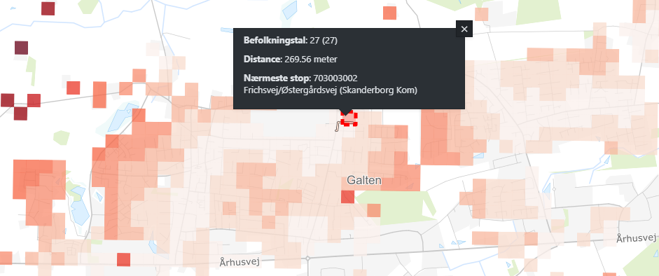
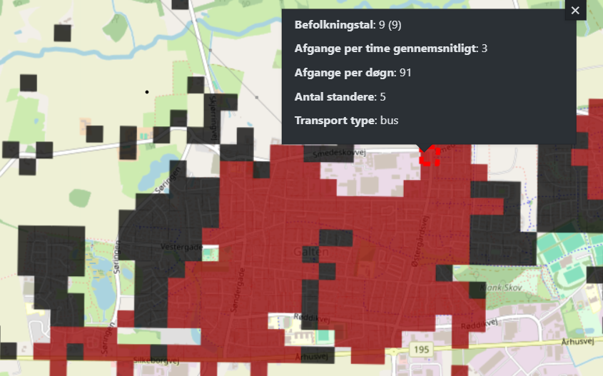

# Formål

Effektivt udregner gå-afstand mellem alle objekter i to inputfiler på OpenStreetMaps vej- og stilag.</br>
Udviklet med henblik på at regne afstande mellem stoppesteder og befolkningskvadratnet men kan anvendes med vilkårligt punktbaseret data.</br>

Eksempler på bruges:
* Grunddata/befolkningsdata.
    * Korteste vej til nærmeste stop fra hvert 100m*100m beboet område.
    * Tælle antal unikke afgange indenfor 500m gå-afstand for hvert beboelseskvadrat.
* CVR/virksomheder.
    * Korteste vej til nærmeste stop fra hver virksomhed.
* Uddannelsesinstitutioner/Uddannelsesinstitutioner med elevtal.
    * Korteste vej til nærmeste stop fra hver uddannelsesinstitution.

Nye opgaver vedrørende afstande på vejnettet kan (relativt) nemt implementeres da programmet er opbygget med kompositionelt design.
<br/>
<br/>


# Data strategier

* Input strategi:
    * Indlæs fil og transformer den således at den som minimum har følgende kolonner:
        * id: unikt id.
        * geometry_center: punkt geometri.
    * F.eks. Befolkningskvadratnet, Arbejdspladser, Udannelsesinstitutioner mv.
* Stop strategi:
    * Indlæs fil og transformer den således at den som minimum har følgende kolonner:
        * geometry: punkt geometri.
        * stop_code: unikt id.
        * stop_name: stop navn, værdier kan efterlades som None hvis ikke det er relevant.
    * Filtyper:
        * MobilePlan csv fil med kolonnerne: UTM32_Easting, UTM32_Northing, Long name, Kode til stoppunkt og Pos.nr.
        * Shapefil med stopnummer, stopnavn og geometri. Kolonnenavne kan være vilkårlige så programmet spørger efter deres navne.
* Dobbeltrettet OSM netværk af typen ”all” hentes automatisk. Inkluderer alle typer veje og stier indenfor det administrative område.

<br/>
<br/>


# Procedure
* Første gang køres setup.py. Efterfølgende springes dette trin over.
* Placer data i mappen **src/Data**.
    * Bemærk stoppestedsgeometrier skal være af typen Point da hvert individuelle stoppested skal være tilstede. MultiPoint kam laves til Point med multipart til singlepart.
* Åben og kør **run.py**.
* Indtast inputs. Valgmuligheder er (...) og default værdi er [...].
    * Ethvert administrative OSM område kan anvendes.
    * Vælg opgave, input data og stop data.
    * Angiv filtre: Flextur, Plustur og nedlagte standere filtreres som default fra og 09 standere beholdes som default.
    * Hvis stopfil er shapefil så angiv navne på kolonner som indeholder stopnummer, stopnavn og geometri.
    * Stander chunk size er default 500, hvis der er problemer med *out of memory*, kan den sænkes mod at programmet bliver lidt langsomere.
    * Mindste antal OSM knuder i uforbundende komponenter er default 200. Kan forøges hvis der er mange tilfælde hvor der ikke findes en vej. Et uforbundet komponent er en subgraf som ikke hænger sammen med hovedgrafen, f.eks. en ikke-brofast Ø eller en gangsti på taget af et museum.
* Vent på at programmet er færdigt. Undgå andre CPU og memory krævende opgaver i mellemtiden.
    * Det er OK hvis "RuntimeWarning: Couldn't reach some vertices." forekommer. Skyldes at den ene OSM knude er del af en uforbundet komponent så der ikke findes en sti til den anden OSM knude.
    * Befolkningskvadratnet i Region Midtjylland tager ca. 120 minutter.
        * Ca. 10 minutter for indlæsning af data.
        * Ca. 35 minutter for Dijkstra's Algoritme.
        * Ca. 45 miutter for at hente geometrien for korteste vej for hvert input.
        * Cirka 30 minutter for at skrive shapefil.
* Output ligger i **src/Resultater**.
* Gå til Webgis afsnit.

<br/>

## Webgis: Nærmeste stop
* Sørg for at original datakilde er i Webgis.
* Lav eller opdater (tøm/tilføj) resultat tabel.
* Refresh materialized views *_shortestpath* og *_shortestpath_line* eller lav nye hvis datakilde har ændret sig (kopier de gamle og ændre tabeller).
* Anvendt farveskala:
    - 0-250m, #FFF5F0
    - 250-500m, #FEE0D2
    - 500-750m, #FCBBA1
    - 750-1000m, #FC9272
    - 1000-1250m, #FB6A4A
    - 1250-1500m, #EF3B2C
    - 1500-1750m, #CB181D
    - 1750-2000m, #99000D
    - 2000-5000m, #6B031A
    - 5000m+, #000000




</br>


## Webgis: Stop indenfor distance
* Sørg for at original datakilde er i Webgis.
* Lav eller opdater (tøm/tilføj) resultat tabel.
* Refresh materialized view *_allnearbystops* eller lav nyt hvis datakilde har ændret sig (kopier det gamle og ændre *K24* og tabeller).
* Anvendt farveskala:
    * Meget høj, #FFE0E0 (afgange_døgn > 216 and bus > 0 and letbane_lokalbane > 0)
    * Høj, #E59B97 (afgange_døgn > 216 and (bus=0 or letbane_lokalbane=0))
    * Middel, #C2584D (96 <= afgange_døgn <= 216)
    * Lav, #950000 (0 < afgange_døgn < 96)
    * Ingen, #000000 (afgange_døgn = 0)



<br/>


## Vigtigt
Alle beregningerne indeholder en usikkerhed da punkter og standere tildeles den nærmeste OSM knude på OSM grafen.<br/>
Selvom Region Midtjylland har 400000 knuder, findes der ikke én knude som er præcist placeret ved punktet.<br/>
I enkelte tilfælde betyder det at et kvadrat har en højere distance sammenlignet med nabokvadraterne, hvis den nærmeste OSM knude er langt væk.<br/>


<br/>
<br/>


# Dokumentation af løsning

Kør følgende for test og code coverage report. Derefter åben test/htmlcov/index.html.
```console
cd test
python -m coverage run -m unittest strategy_testing
python -m coverage report
python -m coverage html
```

Python [OSMNX](https://osmnx.readthedocs.io/en/stable/) og [NetworkX](https://networkx.org/) til at håndtere OSM grafen.<br/>
Python [igraph](https://github.com/igraph/python-igraph) (Python interface til C bibliotek) anvendes til højeffektive udregninger af grafteori bl.a. ved parallelisering på flere CPU-kerner. Beregninger i C er meget hurtigere end beregniner i Python, derfor anvendes igraph fremfor OSMNX. <br/>
Koblingen mellem Python og igraph er lavet med inspiration i Notebook 14 fra [OSMNX Notebooks](https://github.com/gboeing/osmnx-examples)<br/>

Algoritmen løser multi-source multi-target weighted shortest path problemet ved brug af Dijkstras algoritme.</br>
Da flere forskellige opgaver forudsætter at følgende problem skal løses, anvender programmet et strategy pattern efter principperne i kompositionelt design. Med kompositionelt design kan vi meget nemt og effektivt genbruge source code og tilføje nye opgaver og nye måder at indlæse data. Opbygning og afhængigheder i strategy pattern kan ses i følgende UML diagram.</br>


Programmets overordnet struktur:
1. Præprocessering.
    * Indlæs input fil med DataStrategy.
    * Indlæs stop fil med DataStrategy.
    * Hent polygon for det administrative OSM område og fjern kvadrater og stop som befinder sig udenfor.
    * Hent OSM netværk med OSMNX.
    * Fjern uforbundende komponenter fra OSM.
    * Omdan OSM netværket til en igraph graf hvor kanter er vægtet med kantlængde i meter.
    * Gem en mapping af igraph id til osmid og en mapping af osmid til igraph id.
    * Find nærmeste OSM knude til alle punkter og gem distancen.
    * Find nærmeste OSM knude til alle stop og gem distancen.
2. Processering.
    * Find korteste distance fra hver stop knude til alle knuder på grafen.
    * For hver punkt, tildel stop(s) efter metoden i TaskStrategy.
3. Postprocessering.
    * Hvis relevant, find stien på vejnettet mellem punkt og stop og gem som Linestring.
    * Skriv resultater med id fra input.

<br/>
<br/>


## Effektivitet
Definer følgende:
* $V$ betegner sættet af knuder i grafen og antallet er $|V|$.
* $E$ betegner sættet af kanter i grafen og antallet er $|E|$.
* $S$ betegner sættet af sources (startpunkter) og antallet er $|S|$.
* $T$ betegner sættet af targets (slutpunkter) og antallet er $|T|$.
Bemærk at $S$ og $T$ begge er delmænder knuderne på grafen, altså $S \subset V$ og $T \subset V$. <br/>


### Algoritme 1: optimal
Find korteste vej fra hvert startpunkt til hvert slutpunkt $S_i \rightarrow T_j$ for alle $i=1, ..., |S|$ og $j=1, ..., |T|$.
Denne løsning er sikret at give en optimalløsning, dog er det en naiv brute-force tilgang. <br/>

Antal gentagelser af korteste vej algoritmen: $|S| |T|$ <br/>
Forventet tidskompleksitet med Dijkstras Algoritme: $O_1 = O(|S| |T| (|V| + |E|) \ln{(|V|)})$ <br/>


### Algoritme 2: heuristik
Find korteste vej fra hvert startpunkt $S_i$ til sættet af slutpunkter $K_i$ som er tættest på $S_i$ i fugleflugtsdistance, hvor sættet af slutpunkter altid har størrelsen $|K_i|$. $S_i \rightarrow T_j$ for $i=1, ..., |S|$ og $j \in K_i$. <br/>
Præprocesseringen af fugleflugtdistancer koster $O(|S| |T|)$. <br/>
Løsningen er en heuristik tilgang som ikke er garanteret at give en optimalløsning, f.eks. hvis et startpunkt er meget langt væk fra de nærmeste slutpunkter, kan det forventes at distancen i fugleflugt er meget anderledes end distancen på vejnettet. <br/>

Antal gentagelser af korteste vej algoritmen: $|S| |K_i|$ <br/>
Forventet tidskompleksitet med Dijkstras Algoritme: $O_2 = O(|S| |K_i| (|V| + |E|) \ln{(|V|)} + |S| |T|)$ <br/>


### Algoritme 3: optimal
Find korteste vej fra hvert startpunkt $S_i$ til alle knuder i grafen $S_i \rightarrow V_l$ for $i=1, ..., |S|$ og $l=1, ..., |V|$. Problemet er hermed løst da $T \subset V$ så for hvert startpunkt findes det slutpunkt med korteste ditance hvilket koster $O(|S| |T|)$ <br/>

Antal gentagelser af korteste vej algoritmen: $|S|$ <br/>
Forventet tidskomplexitet med Dijkstras Algortime: $O_3 = O(|S| (|V| + |E|) \ln{(|V|)} + |S| |T|)$ <br/>


### Algoritme 4: optimal
Hvis $|S| > |T|$ kan vi omskrive [Algoritme 3](#algoritme-3-optimal) til at løse korteste vej fra hvert slutpunkt $T_j$ til alle knuder i grafen $T_j \rightarrow V_l$ for $l=1, ..., |V|$ og $j=1, ..., |T|$. Efterprocesseringen koster stadig $O(|S| |T|)$. <br/>

Antal gentagelser af korteste vej algoritmen: $|T|$ <br/>
Forventet tidskomplexitet med Dijkstras Algortime: $O_4 = O(|T| (|V| + |E|) \ln{(|V|)} + |S| |T|)$ <br/>


### Konkret eksempel
OSM i Midtjylland har $|V| \approx 400000$ knuder og $|E| \approx 1200000$ stier. <br/>
Befolkningskvadratnettet i Midtjylland har $|S| \approx 110000$ kvadrater, Midttrafik har $|T| \approx 10000$ stoppesteder og sæt antal naboer til $|K|=20$. <br/>

[Algoritme 2](#algoritme-2-heuristik) er $\frac{O_1}{O_2} = 500$ gange hurtigere end [Algoritme 1](#algoritme-1-optimal). <br/>
[Algoritme 3](#algoritme-3-optimal) er $\frac{O_2}{O_3} = 20$ gange hurtigere end [Algoritme 2](#algoritme-2-heuristik). <br/>
[Algoritme 4](#algoritme-4-optimal) er $\frac{O_3}{O_4} = 11$ gange hurtigere end [Algoritme 3](#algoritme-3-optimal). <br/>
Det svarer til at [Algoritme 4](#algoritme-4-optimal) er 110000 gange hurtigere end brute-force metoden, [Algoritme 1](#algoritme-1-optimal). <br/>

[Algoritme 4](#algoritme-4-optimal) tager på nuværende tidspunkt 20 minutter med igraph (C). <br/>
[Algoritme 3](#algoritme-3-optimal) forventes at tage 3.5 timer. <br/>
[Algoritme 2](#algoritme-2-heuristik) forventes at tage 3 dage. <br/>
[Algoritme 1](#algoritme-1-optimal) forventes at tage 4 år! Dog i praksis ville det nok tage nogle dage da den forventet tidskompleksitet af Dijkstra er lille da de fleste kvadrater har et stoppested indenfor nogle kilometre. <br/>
Havde løsningen været med OSMNX (Python) viste mine oprindelige eksperimenter at det i praksis ville tage flere måneder med denne metode.

<br/>
<br/>


# Backlog
* Skrivning af shapefil fra geopandas er langsom for store filer.

